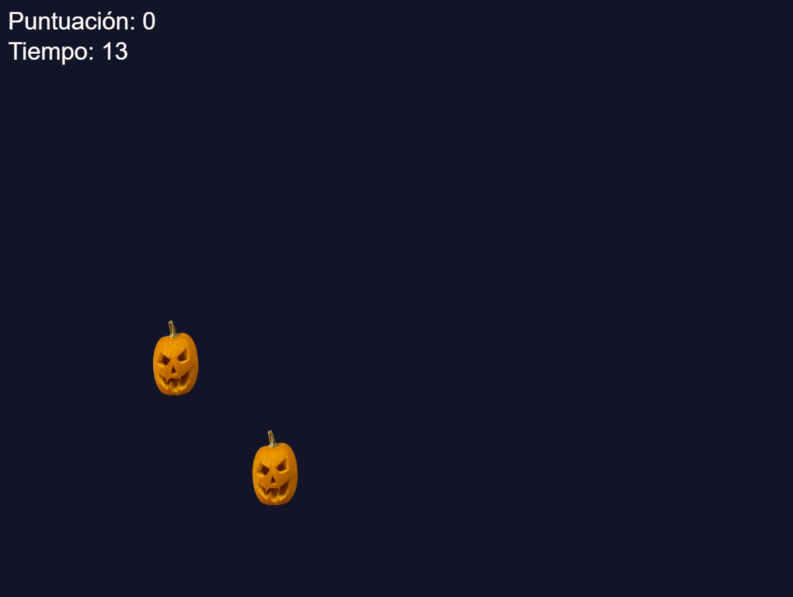
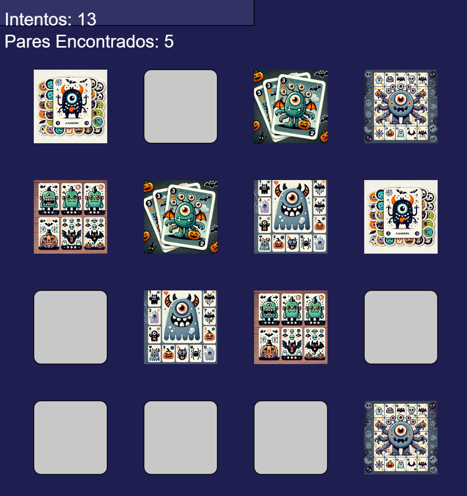
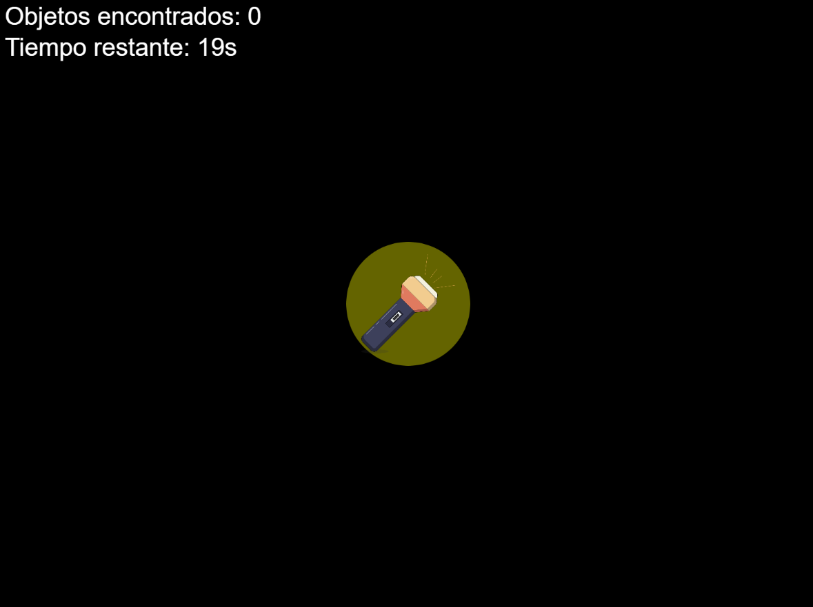
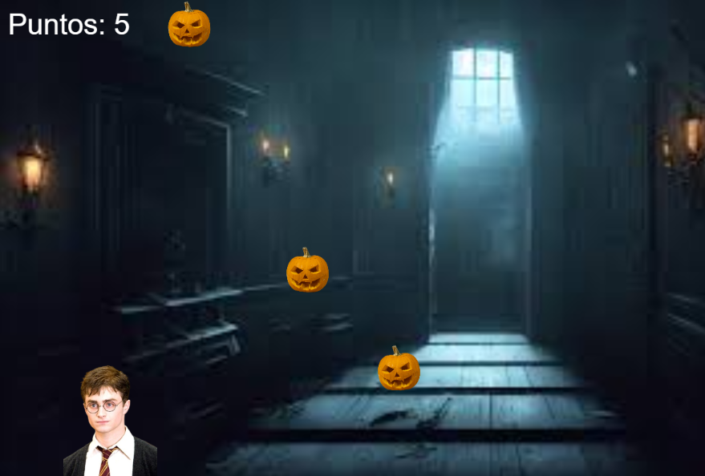

# Game Development with p5.js

Welcome to the Digital Wings Academy's game development repository!

This project is dedicated to showcasing various games we have created using the p5.js library. Each game serves as a fun way to explore programming concepts and engage with interactive learning.

## Table of Contents
- [Overview](#overview)
- [Games](#games)
- [Technologies Used](#technologies-used)
- [How to Run the Games](#how-to-run-the-games)
- [Contributing](#contributing)
- [License](#license)

## Overview
In this repository, you will find a collection of games designed primarily for educational purposes. The games not only aim to entertain but also help students learn programming through hands-on experience.

## Games
1. **Pumpkin Catcher**: A fun game where players catch flying pumpkins to score points.
   
    

2. **Card Matching Game**: A memory game where players flip cards to find pairs.
   
   

3. **Lantern in the Night**: A spooky game where players use a flashlight to find hidden objects.
   
   
   
4. **Harry Potter Pumpkin Collector**: Help Harry Potter move left and right to collect falling pumpkins while avoiding dementors.
   
   

Each game comes with a set of missions or challenges to enhance the learning experience.

## Technologies Used
- [p5.js](https://p5js.org/): A JavaScript library for creative coding, used for creating the games.

## How to Run the Games

To run the games, it is recommended to use the p5.js web editor at [editor.p5js.org](https://editor.p5js.org/). Simply copy and paste the code into the editor to see the games in action!

## Learning Objectives

These games aim to help students:
- Understand basic programming concepts
- Develop logical thinking and problem-solving skills
- Foster creativity through game design and modification

## License

This project is open-source and available under the MIT License.

Happy coding! 🎉
